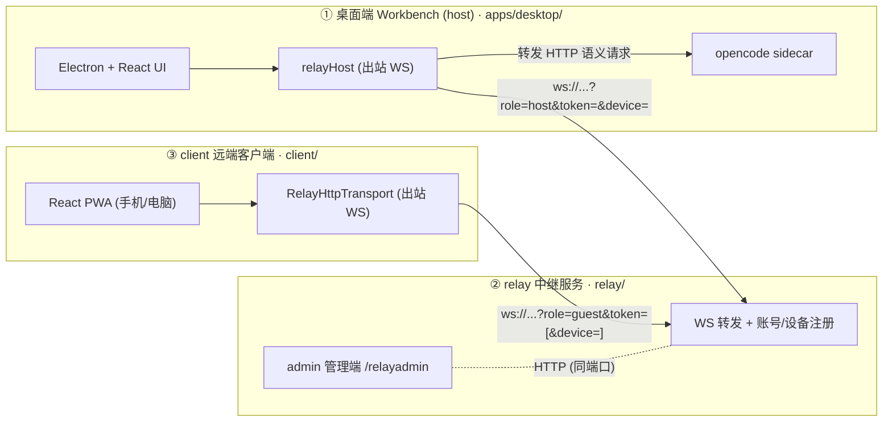
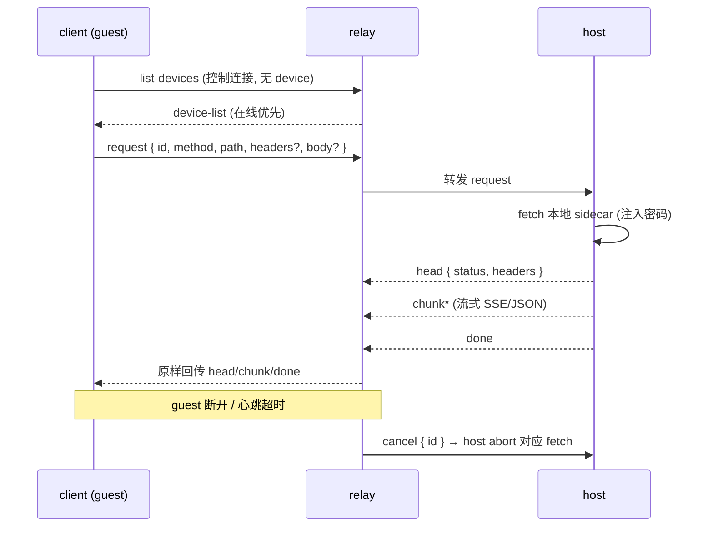
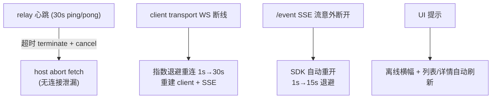

# Workbench

**A config-driven OpenCode desktop shell.** Drop a complete `.opencode/` profile
into `app-config/`, build, and you get a dedicated desktop app for that
configuration — providers, model, skills, agents, commands, MCP, and
permissions all decided by the bundled profile, not configurable at runtime.

Built on [Electron](https://www.electronjs.org) + React + TypeScript, with
[OpenCode](https://opencode.ai) as the bundled agent runtime (single-binary
sidecar, pinned and managed by the app).

## What it is

A reusable desktop shell around the OpenCode agent runtime. The app itself
ships no model/provider/skill configuration UI — everything comes from the
packager's `.opencode/` profile. End users get a focused, locked-down app; the
packager decides what it can do.

- **Config-driven** — `app-config/.opencode/` is bundled as an Electron extra
  resource and deployed to the app's private OpenCode config dir on every
  startup.
- **Local-first** — workspace files, code execution, session history, and
  provenance stay on the machine; only conversation turns reach the model
  provider.
- **Reproducible artifacts** — every agent write appends a version record to
  `.workbench/provenance.jsonl` with its code, environment, and originating
  conversation.
- **Manual approval by default** — dangerous shell commands (deletion, installs,
  remote, privilege) prompt before running. The approval mode is fixed by the
  bundled profile and not switchable to "full" from the UI.
- **Local Python/R kernel + Jupyter** — persistent per-notebook kernels; the
  agent runs code in the workspace.

## Build a dedicated app

1. Put your OpenCode configuration in `app-config/.opencode/` — `opencode.json`
   (providers, model, permission), `skills/`, `agents/`, `commands/`. See
   [`app-config/.opencode/README.md`](./app-config/.opencode/README.md).
2. Fetch the pinned sidecar (kept out of git):

   ```bash
   pnpm install
   bash scripts/dev/fetch-opencode.sh   # the OpenCode agent runtime
   ```

3. Build an installer:

   ```bash
   pnpm build
   pnpm --filter @workbench/desktop package:mac    # macOS
   pnpm --filter @workbench/desktop package:win    # Windows
   pnpm --filter @workbench/desktop package:linux  # Linux
   ```

The resulting `.dmg` / `.exe` / `.AppImage` is a dedicated desktop app for your
`.opencode` profile.

## Brand it

The shipped name is the placeholder **Workbench** (`com.workbench.app`). To
rebrand for your product, change `appId` / `productName` in
`apps/desktop/electron-builder.config.ts`, the app icon in
`apps/desktop/build/`, and the sidebar label in
`apps/desktop/src/renderer/components/sidebar/Sidebar.tsx`.

## Repository layout

| Path | Purpose |
| --- | --- |
| `app-config/.opencode/` | The OpenCode profile the app bundles and deploys |
| `apps/desktop/` | Electron + React shell (`src/` frontend, `src/main/` main process) |
| `packages/sdk/` | `OpenCodeClient` SDK wrapper (isolates the UI from the runtime) |
| `packages/shared/` | Shared domain types and the chart design system |
| `runtime/kernel/` | Python and R kernel bridges |
| `scripts/dev/` | Sidecar fetcher (opencode) |
| `relay/` | **Standalone project** — relay server + admin UI (`admin/`), own pnpm workspace |
| `client/` | **Standalone project** — remote client (drive the desktop from a phone/another machine), own workspace with `sdk/`/`shared/` copies |

## Three projects (remote control)

This repository contains **three independent projects** that talk to each
other only over WebSocket/HTTP — no code imports across project boundaries:



Key properties:

- **host** owns the API keys and the sidecar password — every remote request
  is re-authenticated by the host, and the secret never crosses the relay.
- **relay** is a pure in-memory forwarder; only the account registry
  (token → devices) is persisted.
- **client** lists the account's devices (online first), pairs with one, then
  drives sessions, streaming and file transfer through the relay.

### Wire protocol

One contract, three copies that must be kept in sync manually:
`relay/src/protocol.ts` (authoritative), `client/src/protocol.ts`,
`apps/desktop/src/main/relay-protocol.ts`.



Additional messages: `file-write` upload (`POST /__relay/write-file` writes
into the host workspace, then the prompt references the real path as an
opencode `FilePartInput`), and per-session status via `GET /session/status`
(`busy` / `idle` / `retry`) surfaced in both UIs.

### Connection resilience



See `docs/20260815-10-three-projects.md` for the full design and
`docs/20260815-11-three-projects-readme.md` (zh) for the operational
runbook (deploy, dev, known limits).

## Architecture

Three isolated Electron processes (main / preload / renderer) plus shared
workspace packages. Dependencies flow one way: renderer -> preload
(contextBridge allowlist) -> main -> `packages/sdk` -> runtime. The main
process is split into one-file-per-capability, each owning its state and
started/stopped from `src/main/index.ts`.

### Base app (the shell itself)

The desktop shell cannot run without these:

| Module | Path | Role |
| --- | --- | --- |
| Lifecycle | `apps/desktop/src/main/index.ts` | `app.whenReady` / `before-quit` orchestration |
| Channels | `apps/desktop/src/main/constants.ts` | dev/beta/prod naming and IDs |
| Windows | `apps/desktop/src/main/windows.ts` | main window + state persistence |
| IPC registry | `apps/desktop/src/main/ipc.ts` | all `ipcMain.handle` registrations |
| KV store | `apps/desktop/src/main/store.ts` | electron-store with scoped cache |
| Logging | `apps/desktop/src/main/logging.ts` | unified logs and export |
| Shell env | `apps/desktop/src/main/shell_env.ts` | shell/tool detection, PATH |
| Updater | `apps/desktop/src/main/updater.ts` | electron-updater |
| Preload | `apps/desktop/src/preload/index.ts` | contextBridge allowlist |
| SDK | `packages/sdk` | sole boundary to the agent runtime (`AgentRuntime` + factory) |
| Shared types | `packages/shared` | domain types shared by main + renderer |
| Shell UI | `apps/desktop/src/renderer/{app,components/{sidebar,thread,inspector,command-palette,settings,ui}}` | layout, routing, shell components |

### Capability modules (removable)

Each is an independent capability wired in via `ipc.ts` blocks and
started/stopped from `index.ts`:

| Module | Main file | Package | Capability |
| --- | --- | --- | --- |
| Sidecar runtime | `src/main/server.ts` | `packages/sdk` | spawn `opencode serve`, deploy profile, multi-backend (opencode / claude-code) |
| Workspace files | `src/main/artifact_file.ts` | - | file IO, artifact resolve, dir listing |
| Code kernel | `src/main/kernel.ts` | - | Python/R subprocess execution |
| Terminal | `src/main/terminal.ts` | `packages/terminal` | node-pty sessions (xterm front-end) |
| Scheduler | `src/main/scheduler.ts` | `packages/scheduler` | CronEngine + internal HTTP API + MCP bridge |
| Provenance | `src/main/provenance.ts` | - | JSONL provenance + env lockfile |
| Preview server | `src/main/preview_server.ts` | - | local static file HTTP server (token auth) |
| Web fetch | `src/main/browser.ts` | - | HTTP fetch + HTML-to-text |
| Browser MCP | `src/main/browser-mcp-server.ts` | `packages/browser-mcp` | standalone MCP server + preload/panel |

### Packager profile (not app code)

`app-config/.opencode/` and `app-config/.claude/` are packager-owned and
deployed to the app-private config dir on every startup
(`server.ts:deployBundledProfile()`). The app ships no skill/agent/command at
runtime - swap the profile to get a different product.

## Safety defaults

- The agent may only access the current workspace.
- Command execution, file deletion, dependency installs, and remote connections
  require approval (manual approval mode by default — never ship `full`).
- Provider keys live in the app-private config dir (owner-only); never in
  provenance, logs, crash reports, git, or exports.

## License

[MIT](./LICENSE). Bundled third-party skills and connectors carry their own
licenses.

## Acknowledgements

This project draws inspiration from [Open Science](https://github.com/ai4s-research/open-science)
and [OpenCode](https://github.com/anomalyco/opencode), but is not affiliated
with or endorsed by either project.

> This is beta tooling. Verify outputs before relying on them.