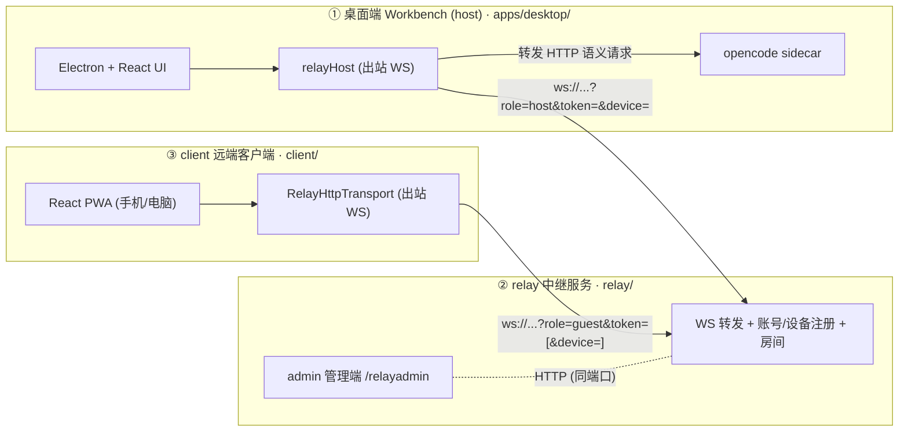

# Workbench

**配置驱动的 OpenCode 桌面外壳。** 把一份完整的 `.opencode/` 配置放进
`app-config/`，构建后即可得到针对该配置的专用桌面应用——provider、模型、
skills、agents、命令、MCP、权限全部由打包配置决定，运行时不可配置。

基于 [Electron](https://www.electronjs.org) + React + TypeScript，以
[OpenCode](https://opencode.ai) 作为内置 agent 运行时（单二进制 sidecar，
版本由应用固定并管理）。

## 它是什么

一个围绕 OpenCode agent 运行时的可复用桌面外壳。应用本身不提供
模型/provider/skill 配置界面——一切都来自打包者的 `.opencode/` 配置。终端
用户得到一个聚焦、锁定的应用；打包者决定它能做什么。

- **配置驱动** — `app-config/.opencode/` 作为 Electron extra resource 打包，
  每次启动自动部署到应用私有的 OpenCode 配置目录（含用户覆盖与 patch 层）。
- **本地优先** — 工作区文件、代码执行、会话历史、provenance 都留在本机；
  只有对话轮次发往模型 provider。
- **可复现产物** — agent 的写类工具调用会向 `.workbench/provenance.jsonl`
  追加记录（当前读侧存在已知问题，见差异清单）。
- **默认手动审批** — 危险命令（删除、安装、远程、提权）运行前需审批；
  审批模式由打包配置固定，UI 不会默认切到 yolo。
- **富输出渲染** — 会话支持 A2UI 声明式卡片、html/svg/echarts/csv 富围栏、
  产物卡与 `workbench:` 键控渲染。
- **远程控制** — 手机/另一台电脑可经 relay 中继驱动桌面端（独立项目，
  见下文「三项目」）。

## 构建一个专用应用

1. 把 OpenCode 配置放进 `app-config/.opencode/`——`opencode.json`
   （provider、model、permission）、`skills/`、`agents/`、`commands/`。详见
   [`app-config/.opencode/README.md`](./app-config/.opencode/README.md)。
2. 拉取固定的 sidecar（不进 git）：

   ```bash
   pnpm install
   bash scripts/dev/fetch-opencode.sh   # OpenCode agent 运行时
   ```

3. 构建安装包：

   ```bash
   pnpm build
   pnpm --filter @workbench/desktop package:mac    # macOS
   pnpm --filter @workbench/desktop package:win    # Windows
   pnpm --filter @workbench/desktop package:linux  # Linux
   ```

产出的 `.dmg` / `.exe` / `.AppImage` 就是针对你 `.opencode` 配置的专用桌面应用。

## 改品牌

默认名是占位符 **Workbench**（`com.workbench.app`）。要换成你的产品品牌，
改 `apps/desktop/electron-builder.config.ts` 的 `appId` / `productName`、
`apps/desktop/build/` 的图标、以及
`apps/desktop/src/renderer/components/sidebar/Sidebar.tsx` 的侧栏标签。

## 仓库结构

| 路径                    | 用途                                                                                      |
| ----------------------- | ----------------------------------------------------------------------------------------- |
| `app-config/.opencode/` | 应用打包并部署的 OpenCode 配置（打包者所有）                                              |
| `apps/desktop/`         | Electron + React 外壳（`src/` 前端，`src/main/` 主进程）                                  |
| `packages/`             | `sdk`（运行时接入层）、`shared`（领域类型）、`browser-mcp`、`terminal`、`scheduler`、`ui` |
| `relay/`                | **独立项目**——中继服务器 + 管理端（`admin/`），自建 pnpm workspace                        |
| `client/`               | **独立项目**——远端客户端（手机/另一台电脑驱动桌面端），自持 `sdk/`/`shared/` 副本         |
| `scripts/`              | sidecar 拉取、渠道构建、部署脚本                                                          |
| `docs/`                 | 方案文档（日期命名）+ `architecture/`（架构现状系列）                                     |

## 文档入口

| 文档                                                  | 内容                                                                                                 |
| ----------------------------------------------------- | ---------------------------------------------------------------------------------------------------- |
| [`docs/architecture/`](./docs/architecture/README.md) | **架构现状系列**（以代码为准）：桌面壳、配置与安全、渲染层、远程、能力模块、工程底座、差异与风险清单 |
| [`docs/`](./docs)                                     | 历史方案文档（设计意图与实施记录）                                                                   |
| [`relay/README.md`](./relay/README.md)                | 中继部署与账号管理手册                                                                               |
| [`AGENTS.md`](./AGENTS.md)                            | 项目约定：设计原则、工程规范、安全默认                                                               |

## 三项目与远程控制

本仓库包含**三个相互独立**的项目，彼此只通过 WebSocket/HTTP 通信，
代码不跨项目 import：



- **host** 持有 API key 与 sidecar 密码——每个远端请求由 host 重新鉴权，
  密钥永不经过 relay。
- **relay** 是纯内存转发器；只持久化账号注册表（token → 设备列表）。
- **client** 拉取账号下设备（在线优先）、配对一台，随后经 relay 驱动会话、
  流式与文件传输；另支持跨账号房间聊天与会话分享。

协议一份契约、三处副本需手动同步；完整机制与已知边界见
[`docs/architecture/04-remote.md`](./docs/architecture/04-remote.md)。

## 架构速览

三个隔离的 Electron 进程（main / preload / renderer）加共享 workspace 包。
依赖单向流动：renderer → preload（contextBridge）→ main → `packages/sdk` →
opencode sidecar。主进程按「一文件一能力」拆分，由 `src/main/index.ts` 统一
编排启停。

| 主题         | 一句话                                                        | 详见                                                                    |
| ------------ | ------------------------------------------------------------- | ----------------------------------------------------------------------- |
| 桌面壳与 IPC | 83 个 IPC 通道 + SSE 事件直连，sidecar 启动链路               | [01-desktop-shell](./docs/architecture/01-desktop-shell.md)             |
| 配置与安全   | 镜像 → 用户覆盖 → patch → provider → MCP 注入；沙箱/权限/脱敏 | [02-config-and-security](./docs/architecture/02-config-and-security.md) |
| 渲染层       | zustand 状态机 + 幂等折叠 + 富输出四通道                      | [03-renderer](./docs/architecture/03-renderer.md)                       |
| 远程与房间   | relay/client/host 三方 + 连接稳定三层                         | [04-remote](./docs/architecture/04-remote.md)                           |
| 能力模块     | 调度器、终端、kernel、浏览器 MCP、语音、预览                  | [05-capabilities](./docs/architecture/05-capabilities.md)               |
| 工程底座     | 质量门禁、测试、版本约定、部署脚本                            | [06-engineering](./docs/architecture/06-engineering.md)                 |

## 安全默认

- agent 只能访问当前工作区；sidecar 与 kernel 的执行可由 OS 级沙箱包装
  （macOS seatbelt / Linux bwrap，策略只能收紧）。
- 命令执行、文件删除、依赖安装、远程连接需审批（默认 review 模式）。
- provider key 建议只存 app 私有配置（设置页），不要写进随包分发的 profile；
  密钥永不进 provenance、日志、崩溃报告、git。

## 许可证

[MIT](./LICENSE)。内置的第三方 skill 和连接器各有自己的许可。

## 致谢

本项目借鉴了 [Open Science](https://github.com/ai4s-research/open-science) 和
[OpenCode](https://github.com/anomalyco/opencode) 的设计思路，但与两个项目无直接关联。

> 这是 beta 工具。依赖其输出前请自行验证；文档与代码的已知差异见
> [`docs/architecture/07-doc-code-gaps.md`](./docs/architecture/07-doc-code-gaps.md)。
