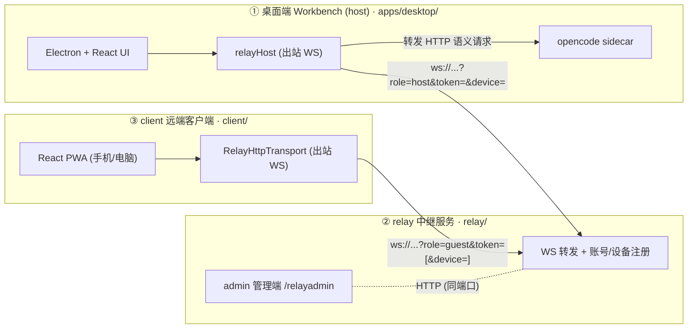
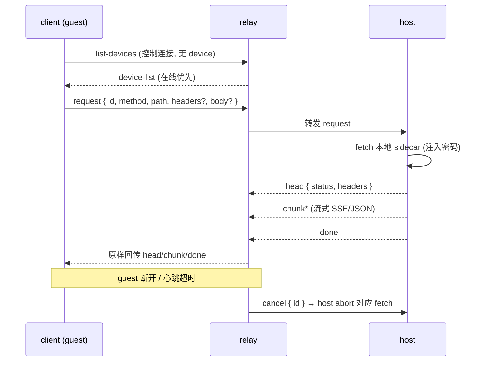
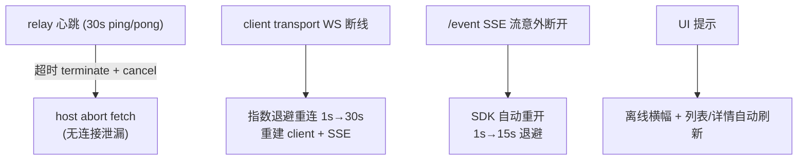

# Workbench

**配置驱动的 OpenCode 桌面外壳。** 把一份完整的 `.opencode/` 配置放进
`app-config/`，构建后就能得到针对该配置的专用桌面应用——
provider、模型、skills、agents、命令、MCP、权限全部由打包时的配置决定，
运行时不可配置。

基于 [Electron](https://www.electronjs.org) + React + TypeScript 构建，以
[OpenCode](https://opencode.ai) 作为内置的 agent 运行时（单二进制 sidecar，
由 app 固定版本并管理）。

## 它是什么

一个围绕 OpenCode agent 运行时的可复用桌面外壳。app 本身不提供
模型/provider/skill 配置界面——一切来自打包者的 `.opencode/` 配置。终端
用户得到一个聚焦、锁定的应用；打包者决定它能做什么。

- **配置驱动** — `app-config/.opencode/` 作为 Electron extra resource 打包，
  每次启动时自动部署到 app 私有的 OpenCode 配置目录。
- **本地优先** — 工作区文件、代码执行、会话历史、provenance 都留在本地；
  只有对话轮次发往模型 provider。
- **可复现工件** — 每次 agent 写入追加一条版本记录到
  `.workbench/provenance.jsonl`，含代码、环境、来源会话。
- **默认手动审批** — 危险 shell 命令（删除、安装、远程、提权）运行前需
  审批。审批模式由打包配置固定，UI 不可切到 "full"。
- **本地 Python/R kernel + Jupyter** — 每个 notebook 独立的持久 kernel；
  agent 在工作区执行代码。

## 打包一个专用应用

1. 把你的 OpenCode 配置放进 `app-config/.opencode/`——`opencode.json`
   （provider、model、permission）、`skills/`、`agents/`、`commands/`。详见
   [`app-config/.opencode/README.md`](./app-config/.opencode/README.md)。
2. 拉取固定的 sidecar（不进 git）：

   ```bash
   pnpm install
   bash scripts/dev/fetch-opencode.sh   # OpenCode agent 运行时
   ```

3. 构建安装包：

   ```bash
   pnpm build
   pnpm --filter @workbench/desktop package:mac    # macOS
   pnpm --filter @workbench/desktop package:win    # Windows
   pnpm --filter @workbench/desktop package:linux  # Linux
   ```

产出的 `.dmg` / `.exe` / `.AppImage` 就是针对你 `.opencode` 配置的专用桌面应用。

## 改品牌

默认名是占位符 **Workbench**（`com.workbench.app`）。要换成你的产品品牌，
改 `apps/desktop/electron-builder.config.ts` 的 `appId` / `productName`、
`apps/desktop/build/` 的图标、以及
`apps/desktop/src/renderer/components/sidebar/Sidebar.tsx` 的侧栏标签。

## 仓库结构

| 路径 | 用途 |
| --- | --- |
| `app-config/.opencode/` | app 打包并部署的 OpenCode 配置 |
| `apps/desktop/` | Electron + React 外壳（`src/` 前端，`src/main/` 主进程） |
| `packages/sdk/` | `OpenCodeClient` SDK 封装（把 UI 与运行时隔离） |
| `packages/shared/` | 共享领域类型 + 图表设计系统 |
| `runtime/kernel/` | Python 与 R kernel 桥 |
| `scripts/dev/` | sidecar 拉取脚本（opencode） |
| `relay/` | **独立项目** —— 中继服务器 + 管理端（`admin/`），自建 pnpm workspace |
| `client/` | **独立项目** —— 远端客户端（手机/另一台电脑驱动桌面端），自持 `sdk/`/`shared/` 副本 |

## 三项目（远程控制）

本仓库包含**三个相互独立**的项目，彼此只通过 WebSocket/HTTP 通信，
代码不跨项目 import：



关键特性：

- **host** 持有 API key 与 sidecar 密码——每个远端请求由 host 重新鉴权，
  密钥永不经过 relay。
- **relay** 是纯内存转发器；只持久化账号注册表（token → 设备列表）。
- **client** 拉取账号下设备（在线优先）、配对一台，随后经 relay 驱动
  会话、流式与文件传输。

### 线协议

一份契约、三处副本需手动同步：`relay/src/protocol.ts`（权威定义）、
`client/src/protocol.ts`、`apps/desktop/src/main/relay-protocol.ts`。



其它消息：文件上传（`POST /__relay/write-file` 写入 host 工作区，prompt
以 opencode `FilePartInput` 引用真实路径）；会话状态
`GET /session/status`（`busy` / `idle` / `retry`）在两端 UI 展示。

### 连接稳定（三层防护）



完整设计与运维手册（部署、开发、已知限制）见
`docs/20260815-10-three-projects.md` 与 `docs/20260815-11-three-projects-readme.md`。

## 架构

三个相互隔离的 Electron 进程（main / preload / renderer）加共享的 workspace
包。依赖单向流动：renderer -> preload（contextBridge 白名单）-> main ->
`packages/sdk` -> 运行时。主进程按「一文件一能力」拆分，每个模块持有自己的
状态，由 `src/main/index.ts` 统一编排启停。

### 基础 app 内容（外壳本身）

桌面外壳离不开这些模块：

| 模块 | 路径 | 职责 |
| --- | --- | --- |
| 生命周期 | `apps/desktop/src/main/index.ts` | `app.whenReady` / `before-quit` 编排 |
| 渠道常量 | `apps/desktop/src/main/constants.ts` | dev/beta/prod 命名与 ID |
| 窗口管理 | `apps/desktop/src/main/windows.ts` | 主窗口 + 状态持久化 |
| IPC 注册中心 | `apps/desktop/src/main/ipc.ts` | 所有 `ipcMain.handle` 注册 |
| KV 存储 | `apps/desktop/src/main/store.ts` | electron-store，带 scope 缓存 |
| 日志 | `apps/desktop/src/main/logging.ts` | 统一日志与导出 |
| Shell 环境 | `apps/desktop/src/main/shell_env.ts` | shell/工具探测、PATH |
| 自动更新 | `apps/desktop/src/main/updater.ts` | electron-updater |
| 桥接层 | `apps/desktop/src/preload/index.ts` | contextBridge 白名单暴露 |
| SDK | `packages/sdk` | 与 agent 运行时的唯一边界（`AgentRuntime` + factory） |
| 共享类型 | `packages/shared` | main 与 renderer 共享的领域类型 |
| 外壳 UI | `apps/desktop/src/renderer/{app,components/{sidebar,thread,inspector,command-palette,settings,ui}}` | 布局、路由、外壳组件 |

### 能力域模块（可裁剪）

每个是独立能力，通过 `ipc.ts` 的分块注册接入，由 `index.ts` 编排启停：

| 模块 | Main 文件 | 关联包 | 能力 |
| --- | --- | --- | --- |
| Sidecar 运行时 | `src/main/server.ts` | `packages/sdk` | spawn `opencode serve`、部署 profile、多后端（opencode / claude-code） |
| 工作区文件 | `src/main/artifact_file.ts` | - | 文件读写、artifact 解析、目录列表 |
| 代码内核 | `src/main/kernel.ts` | - | Python/R 子进程执行 |
| 终端 | `src/main/terminal.ts` | `packages/terminal` | node-pty 会话（xterm 前端） |
| 定时任务 | `src/main/scheduler.ts` | `packages/scheduler` | CronEngine + 内部 HTTP API + MCP 桥接 |
| 溯源 | `src/main/provenance.ts` | - | JSONL provenance + env lockfile |
| 预览服务 | `src/main/preview_server.ts` | - | 本地静态文件 HTTP 服务（token 鉴权） |
| 网页抓取 | `src/main/browser.ts` | - | HTTP 抓取 + HTML 转文本 |
| 浏览器 MCP | `src/main/browser-mcp-server.ts` | `packages/browser-mcp` | 独立 MCP server + preload/panel 注入 |

### 打包者配置（非 app 代码）

`app-config/.opencode/` 与 `app-config/.claude/` 由打包者提供，每次启动由
`server.ts:deployBundledProfile()` 部署到 app 私有配置目录。app 运行时不内置
任何 skill/agent/command--换一份 profile 就是另一个产品。

## 安全默认

- agent 只能访问当前工作区。
- 命令执行、文件删除、依赖安装、远程连接需审批（默认手动审批模式——永不
  ship `full`）。
- provider key 存在 app 私有配置目录（owner-only）；永不进 provenance、日志、
  崩溃报告、git 或导出项目。

## 许可证

[MIT](./LICENSE)。内置的第三方 skill 和连接器各有自己的许可。

## 致谢

本项目借鉴了 [Open Science](https://github.com/ai4s-research/open-science) 和
[OpenCode](https://github.com/anomalyco/opencode) 的设计思路，但与两个项目无直接关联。

> 这是 beta 工具。依赖其输出前请自行验证。