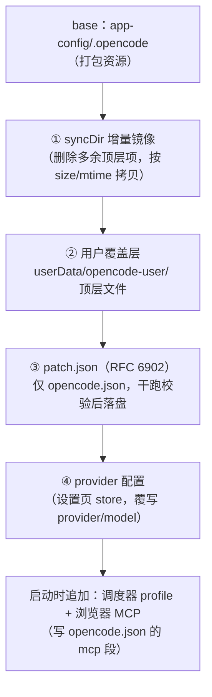

# 02 · 配置部署与安全边界

> 所属：架构现状系列 · [返回索引](./README.md)

## 1. 部署管线总览

每次启动（以及运行时重启）由 `server.ts:deployBundledProfile()` 执行，
产物写入 `userData/runtime/xdg-config/opencode/`，sidecar 以
`XDG_CONFIG_HOME` 读取：

各层路径：

| 层 | 路径 | 可写方 |
| --- | --- | --- |
| base | 打包资源 `app-config/.opencode`（dev 直接读仓库目录） | 打包者 |
| 部署目标 | `userData/runtime/xdg-config/opencode/` | 仅应用（每次镜像覆盖） |
| 用户覆盖 | `userData/opencode-user/`（`opencode.json`、`sandbox.json`、`patch.json` 等） | 终端用户/管理员 |
| patch | `userData/opencode-user/patch.json` | 终端用户/管理员 |
| 管理红线 | `userData/opencode-user/requirements.json`（**仓库未提供，需管理员手放**） | 管理员 |
| provider | electron-store：`provider-configs`（数组取 active，兼容单条 `provider-config`） | 设置页 |
| 交互开关 | base 的 `interaction/renderers.json`、`interaction/ui.json` | 打包者 |

`userPatchDir()` 刻意放在镜像目标之外，因此 `syncDir` 的 prune 不会碰用户文件。

## 2. 各步骤行为

### ① syncDir 增量镜像

`syncDir.ts`：先删除目标中源不存在的顶层项，再递归按 size/mtime 只拷贝变化
文件；符号链接直接复制。

### ② 用户覆盖层

`profilePatch.ts:applyUserOverlay()`：

- 遍历用户目录的**顶层普通文件**（目录与嵌套文件被跳过），跳过保留名
  （`patch.json`、`deployed-manifest.json`、`requirements.json`）；
- 仅 `sandbox.json` 覆盖需要过 `assertSandboxOverlayTightens`
  （mode/network 只能收紧、已开启的 `required` 不能关）；
- 其余文件直接 `cpSync` 进目标目录。

### ③ patch.json

- 仅支持 `target: "opencode.json"`，操作按 RFC 6902。
- 硬拒路径：`/instructions` 以及 `requirements.json` 中声明的
  `forbiddenPaths`。
- 权限**只许收紧**：相对 base（缺省按 ask 计）排序 `allow > ask > deny`，
  `permissionCeiling` 只约束本 patch 触碰的键。
- 写入前干跑校验（`validateProfilePatch`）；设置页走 CAS：`expectedBaseHash`
  与当前部署文件指纹不一致时返回 `{ok:false, stale:true}`。
- 每次部署写 `userData/opencode-user/deployed-manifest.json`：base/merged/patch
  三类指纹、`fileOverrides`、`sourceChanged`（打包源被改动时告警）。
- 读侧 `explainConfig` 重放 patch，返回 `{merged, origins(顶层键归属), patchApplied}`。

### ④ provider 配置

`applyUserProviderConfig()`：把设置页的 provider（`npm: @ai-sdk/openai-compatible`、
baseURL、apiKey、模型 id）写入 `opencode.json` 的 `provider` 段并设置
`json.model = "<provider>/<model>"`。**该步骤在 patch 之后执行，因此会覆盖
patch 里对 `/model` 的修改。**

### 启动时追加注入

`startSidecar()` 内还会：

- `deploySchedulerProfile()`：写 `skills/scheduler/SKILL.md`、`commands/scheduler.md`，
  并合并 `mcp.scheduler`（本地 stdio，环境变量带 API URL/Token）；
- `getBrowserMcp().deploy()`：合并 `mcp.browser`（本地 stdio）。

这两步的产物不进入部署 manifest 指纹。

### interaction 配置

base 中的 `interaction/renderers.json`（已启用 `kv-card`）与 `ui.json`
（如 `expandThreadDetails:false`）随镜像进入目标目录；渲染层经
`profile-interaction` IPC 读取，优先级为**用户 localStorage > profile > 内置
默认**。渲染器只有开关，不加载 React 代码（见 [03-renderer](./03-renderer.md)）。

## 3. 沙箱（OS 级）

- 配置 `sandbox.json`：`{mode: full-access | workspace-write | read-only,
  network: open | loopback-only, required: boolean}`，默认
  `workspace-write + open + required:false`（`sandbox/types.ts`）。
- 策略校验 `sandbox/policy.ts`：mode/network 只能单向收紧，开启的 `required`
  不能关闭；用户覆盖同样受限。
- 实现 `sandbox/manager.ts:wrapSpawn()`：
  - `full-access` 直通；
  - macOS：`seatbelt.ts` 生成 `(deny default)` profile，允许读，写限定
    writableRoots + workspace + tmp，对 `.git`、`.workbench` 拒绝写入；
    `loopback-only` 只放行 127.0.0.1/::1；用 `/usr/bin/sandbox-exec -f` 包装；
  - Linux：`bwrap.ts` 探测 `bwrap`（WSL1 拒绝），`--ro-bind / /` + 可写目录
    `--bind`，`loopback-only` 时 `--unshare-net`；
  - 后端不可用且 `required:true` 抛错拒绝启动，否则直跑并 warn。
- **集成点只有两处**：sidecar spawn 与 kernel spawn。终端 PTY、whisper、
  浏览器 MCP HTTP API 不受沙箱约束。

## 4. 权限模式

`OpenCodeClient.setPermissionMode` 直接 PATCH sidecar 的 `/global/config`：

| 模式 | bash/edit/write/external_directory | doom_loop |
| --- | --- | --- |
| `review`（默认） | ask | deny |
| `auto` | allow | deny |
| `yolo` | allow | allow |

渲染层 `ModeSwitch` 对切入 yolo 做二次确认；permission 卡若命中
`.opencode/`、`.git/`、`AGENTS.md` 会显示警示条（提示性防御，非硬边界）。
ClaudeCodeAdapter 的映射为 review→`default`、auto→`acceptEdits`、
yolo→`bypassPermissions`。

## 5. 脱敏与审计

- `redact.ts`：键名命中 `token|secret|password|authorization|api key|access key`
  的值整体替换 `[REDACTED]`；字符串内联的 `sk-…`、`Bearer …`、JWT 同样替换；
  纯函数、保持结构。provenance 写入前调用。
- `provenance.ts`：向 `<workspace>/.workbench/provenance.jsonl` 追加
  `{sessionId, callId, tool, input, output, model, timestamp}`。
  注意读侧 `listProvenance(path)` 过滤字段与写侧记录结构不一致，当前列表恒空
  （见[差异清单](./07-doc-code-gaps.md)）。
- `snapshot.ts`：压缩事件时写
  `<workspace>/compaction-snapshots/<session>-<version>.json`，每会话上限 20 份。
  版本计数在渲染层内存中维护。

## 6. 密钥处理现状

- sidecar 密码：每进程 `randomUUID()` 生成，只存在于主进程环境与内存，转发时
  注入 Basic 头；客户端永远拿不到。
- provider key：设置页写入 electron-store（应用私有）；打包 profile 中如
  直接内置 apiKey，会随安装包分发并复制到部署目录——打包者需自行权衡，
  见[差异清单](./07-doc-code-gaps.md)「安全与策略」一节。
- relay token：存 electron-store，`relay-status` 只回 `tokenSet` 布尔值。

## 7. 文件速查

| 主题 | 文件 |
| --- | --- |
| 部署入口 | `apps/desktop/src/main/server.ts`（`deployBundledProfile`、`applyUserProviderConfig`、`startSidecar`） |
| 覆盖/patch | `apps/desktop/src/main/profilePatch.ts`、`packages/shared/src/patchOverlay.ts` |
| 镜像 | `apps/desktop/src/main/syncDir.ts` |
| 沙箱 | `apps/desktop/src/main/sandbox/{manager,bwrap,seatbelt,policy,types}.ts`、`packages/shared/src/sandbox.ts` |
| 脱敏/审计 | `apps/desktop/src/main/{redact.ts,provenance.ts,snapshot.ts}` |
| 交互配置 | `packages/shared/src/interaction.ts`、`app-config/.opencode/interaction/*.json` |
