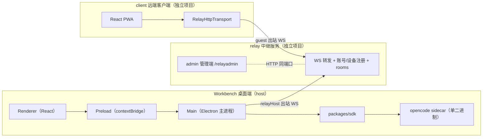

# 架构现状（以代码为准）

本系列描述 Workbench 仓库**代码的实际实现状态**，不是方案设计。
`docs/` 根目录下的日期文档是历史方案（设计意图与实施记录），本系列是
现状说明（实际行为）；两者冲突时，**以本系列与代码为准**。

- 核实日期：2026-09-18（基于当前工作区源码逐文件核对 + 抽样运行验证）。
- 写作方式：每个结论都能在代码中找到对应文件；跨文档的偏差与风险集中
  记录在[差异与风险清单](./07-doc-code-gaps.md)，并附证据（文件:行号）。

## 维护约定

- 改代码时同步更新对应篇；新增能力模块时补进 `05-capabilities.md`。
- 差异清单中的条目修复后，从清单删除，并把结论并入对应架构篇。
- 本系列只描述 `apps/desktop/`、`packages/`、`relay/`、`client/` 的**当前**
  实现；规划中的能力请写进 `docs/` 根目录的新方案文档，不要混入本系列。

## 系统全景



- 三项目**代码零跨 import**，只通过 WS/HTTP 通信；协议三副本手动同步
  （见 [远程访问](./04-remote.md)）。
- 桌面端不直连模型：一切对话与文件操作经本地 `opencode serve` sidecar；
  UI 不直接调用 sidecar，统一经过 `packages/sdk`。

## 文档索引

| 文档 | 内容 |
| --- | --- |
| [01-desktop-shell.md](./01-desktop-shell.md) | Electron 三进程模型、主进程模块与 IPC、sidecar 启动链路、SDK/AgentRuntime 边界 |
| [02-config-and-security.md](./02-config-and-security.md) | profile 部署管线（镜像 → 用户覆盖 → patch → provider → MCP 注入）、沙箱、权限模式、脱敏与审计 |
| [03-renderer.md](./03-renderer.md) | 路由与状态管理、与主进程的 IPC 面、会话渲染管线、富输出四通道、上下文面板 |
| [04-remote.md](./04-remote.md) | relay 服务器、host 侧 relayHost/roomPeer、client、rooms、连接稳定三层、协议副本 |
| [05-capabilities.md](./05-capabilities.md) | 调度器、终端、Python/R kernel、浏览器 MCP、离线语音、预览服务、自动更新 |
| [06-engineering.md](./06-engineering.md) | 仓库布局与三个 workspace、质量门禁、测试现状、版本约定、部署脚本 |
| [07-doc-code-gaps.md](./07-doc-code-gaps.md) | 已核实的文档↔代码差异、安全缺口与修复建议 |

## 一句话数据流

```text
opencode sidecar (HTTP + SSE)
  → packages/sdk 归一化事件（text / reasoning / tool / session.* / question / permission）
  → renderer runtime store 幂等折叠（text:<partId> / tool:<callId> / artifact:<path>）
  → BlockList（工作块合并）→ MarkdownViewer（富围栏 / A2UI / 产物卡）
```

远端数据流：`client（guest WS）→ relay（内存转发，注入校验）→ host relayHost
→ 本地 sidecar（充满密码）`；响应按 `head / chunk* / done` 原样回流。
